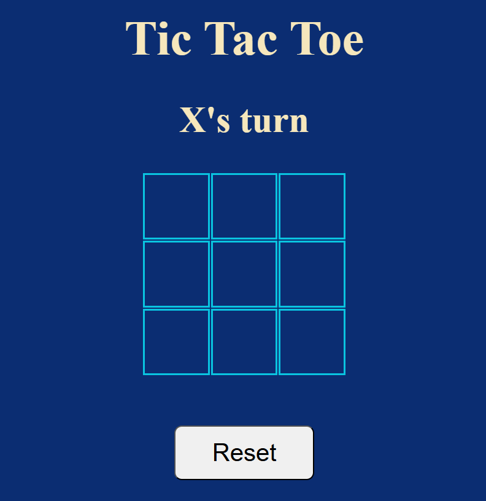

# 🎮 Tic Tac Toe Game

A simple and interactive Tic Tac Toe game built using **HTML, CSS, and JavaScript**.  
This project was created as part of Hackathon event to build a classic two-player game.

---

## 📌 Project Description

Tic Tac Toe is a classic two-player game where players take turns marking spaces in a 3×3 grid. The player who succeeds in placing three of their marks in a horizontal, vertical, or diagonal row wins the game.

This project allows two players to play the game in the browser with a clean and simple user interface.

---

## ⚙️ Installation & Usage

1. Clone the repository

    ```bash
    git clone https://github.com/rumanakadri/tictactoe.git
    ```

2. Navigate to project folder - **tictactoe**

3. Open the **index.html** file in your browser

4. Click any grid to start playing game. Players can take turn to mark it either 'O' or 'X'

5. The game will display winner at the end or announces a draw.

6. Use the restart button to play again.


## 🛠 Technologies
- HTML
- CSS
- Javascript

## 📷 Screenshot


## 🔮 Future Features
- Add score tracking
- Leaderboard functionality
- Sound effects